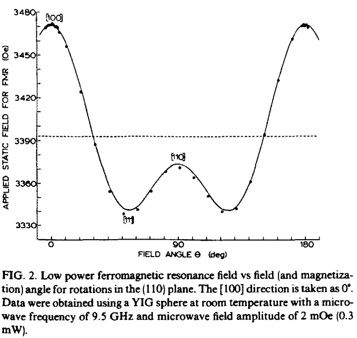
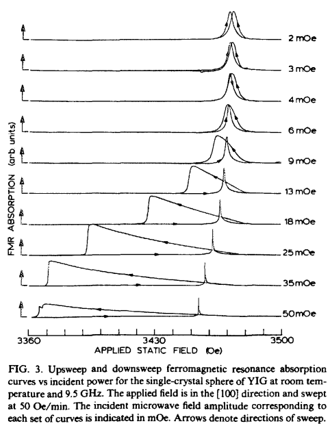
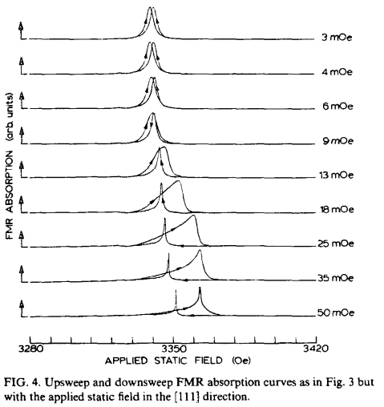
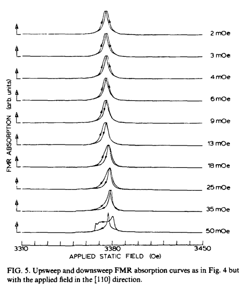
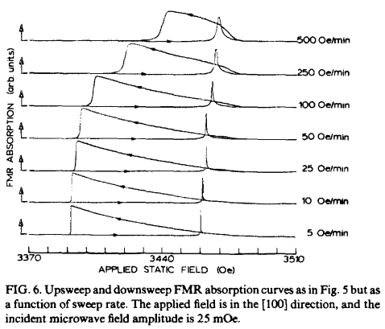
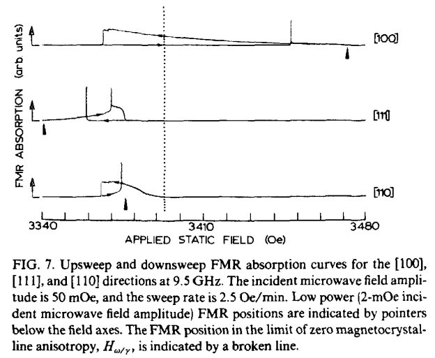
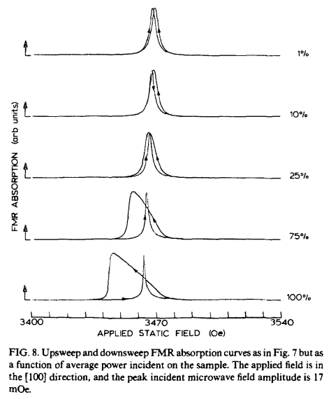
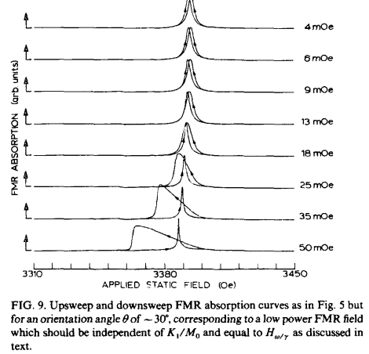

### 文章推荐：YIG中的磁晶各向异性和非线性效应：

这篇发表于1985年的文章揭示了YIG球的**非线性效应与磁晶各项异性**的关系。

Foldover效应， 比如[杜芬振子-Duffing Oscillator](https://en.wikipedia.org/wiki/Duffing_equation)

由于YIG的磁晶各向异性导致了铁磁共振中非线性项的存在。因此，YIG的铁磁共振会出现非线性导致的foldover效应。

磁铁矿晶体的磁晶各项异性。（与YIG类似）

磁晶各向异性是亚铁磁体的固有特性，与晶粒尺寸和形状无关。通过测量沿不同晶体方向的磁化曲线，可得到图中曲线，图片中并非YIG材料，而是磁铁矿晶体。在此为了说明磁晶各项异性的表现。
(<111>为易磁化的方向(易轴)，<100>是难磁化的方向(难轴)，<110>是中间磁化难度的方向(中间轴)。)

### YIG铁磁共振磁晶各向异性的关键性进展

McKinstry, Kevin D., Carl E. Patton, and Milind Kogekar. "Low power nonlinear effects in the ferromagnetic resonance of yttrium iron garnet." Journal of applied physics 58.2 (1985): 925-929.

*　[文章连接](https://aip.scitation.org/doi/abs/10.1063/1.336167)

*　[Sci-hub入口](https://sci-hub.ru/10.1063/1.336167)

钇铁石榴石铁磁共振的低功率非线性效应，科罗拉多州立大学，1985年。

研究对象： 1.339毫米直径，表面抛光的YIG球体。吸收线宽为：3.2 奥斯特(Oe) 。作者也意识到这个线宽比起通常的 0.5 奥斯特(Oe)有些过大了。但是这并不是此研究的重点。

晶相的确定方法为： 进动型 X 射线衍射照相机(x-ray precession camera methods)。
相关资料：[1960 年代，贝尔电话实验室的晶相确定方法](https://www.youtube.com/watch?v=Ojm_R1t9is4)， 需要连接youtube。如果你能看到视频，则会明白这种测定单晶体晶相的方法绝对精准，但是非常费时费力。

FIG.1 - 实验装置。除了电磁铁和高斯计，这个实验组在1980年代基本上靠着各种部件（基于Varian的电子顺磁共振仪）自己搭建了一台微波频段的[VNA](https://en.wikipedia.org/wiki/Network_analyzer_(electrical))，包括CW模式和pulse模式。脉冲微波功率由精细衰减器控制，脉冲长度从 5 皮秒到 10 毫秒。微波的最大功率为258毫瓦，对应 50 mOe 的微波驱动场强。
右上角部分为微波发生装置，右下部分则为微波分析装置，左侧装置则为微波功率的精细调节装置。

FIG.2 - 铁磁共振场与YIG晶相的关系。数据在室温、0.3毫瓦功率、9.5GHz的微波输入功率情况下采集。虚线表示“零各向异性场的铁磁共振位置”(zero anisotropy FMR position)。

FIG.3 - [100]晶相的YIG 单晶球在室温和 9.5 GHz 下的上扫和下扫铁磁共振吸收曲线与入射功率的关系。从图中可以看到非常强的非线性效应，foldoverz转向低频。

FIG.4 - [111]晶相的YIG 单晶球在室温和 9.5 GHz 下的上扫和下扫铁磁共振吸收曲线与入射功率的关系。从图中可以看到相对于[100]晶相，非线性效应反转，foldoverz转向高频。

FIG.5 - [110]晶相的YIG 单晶球在室温和 9.5 GHz 下的上扫和下扫铁磁共振吸收曲线与入射功率的关系。从图中可以看到对比[100]和晶相，非线性效应最弱且趋势不明显。

FIG.6 - [100]晶相的YIG 单晶球在室温和 9.5 GHz 下的上扫和下扫铁磁共振吸收曲线与扫场速率的关系。扫场速率越慢，则foldover曲线越精细。

FIG.7 - 在最高微波功率下和最精细扫场速率下的三个晶相[100]、[110]和[111]的对比。
箭头位置则为极低功率下无非线性效应的共振位置(依旧有各向异性场的影响)。
虚线表示“零各向异性场的铁磁共振位置”(zero anisotropy FMR position)。

FIG.8 - [100]晶相的YIG 单晶球在室温和 9.5 GHz 下的上扫和下扫铁磁共振吸收曲线与平均功率的关系。该结果使用了100微秒的微波脉冲，而不是持续波。
图中百分比代表占空比(duty cycle)，占空比越大，则非线性效应越明显。（宽度为100微秒、占空比低于1%的脉冲微波由于平均效应，几乎不显示非线性效应）

FIG.9 - FIG.5中的结果，偏转磁场30度再测了一遍。显示出了非线性效应，然而这和理论预测并不相符。

### 总结：

 YIG的非线性效应（foldover effect）与磁晶各向异性高度相关，并形成异常的高频驱动下的磁滞回线（loop）。使用超短微波短脉冲时进行实验时，这些非线性效应逐渐消失了。
